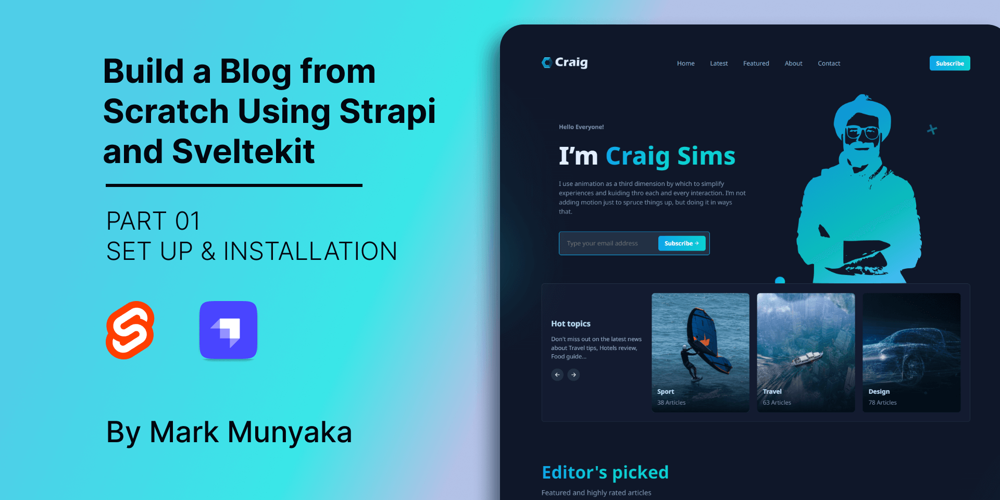
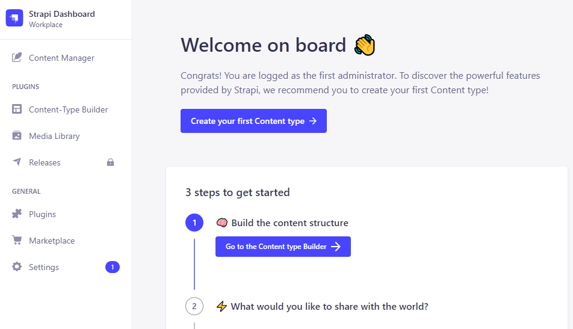
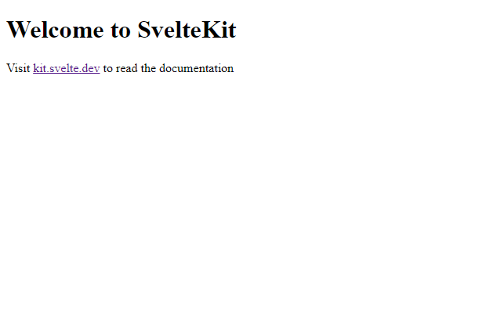

<!-- # Article Title -->
# Build a blog from scratch using Strapi and Sveltekit

<!-- -->


<!-- # Article Subtitle -->
## **Part 01: Setup and Installation**

<!-- ## Outline -->
## Outline

- [Introduction](#introduction)
- [Prerequisites](#prerequisites)
- [Strapi Setup](#strapi-setup)
- [Sveltekit Setup](#sveltekit-setup)
- [Conclusion](#conclusion)
- [Author](#author)
- [Sponsor](#sponsor)

<!-- ## Introduction -->
## Introduction

In this tutorial, you will learn how to create a blog website using Strapi as a CMS and Sveltekit as the frontend framework.

This tutorial is split into a series of articles:

- [Part 01: Setup and Installation](github.com/Marktawa/sveltekit-strapi-blog-article)
- Part 02: 
- Part 03:
- Part 04:

This tutorial is Part 01 of the series. It focuses on the set up and installation of the project.

<!-- ## Prerequisites -->
## Prerequisites

To follow along with this tutorial you must have some knowledge of HTML, CSS, and JavaScript. Knowledge of Strapi and Sveltekit/Svelte is helpful but not necessary.

In addition, you need the following tools installed on your machine:

- Node.js: the latest LTS version
- yarn 

## Strapi Setup

Strapi will act as the CMS for the blog app we are building. To get started open up your terminal and create a folder to store all the code for the project.

```bash
mkdir sveltekit-strapi-blog
cd sveltekit-strapi-blog
```

Inside the `sveltekit-strapi-blog` folder, scaffold a Strapi app:

```bash
npx create-strapi-app@latest backend --quickstart --no-run
```

After installation of the Strapi app is complete, create a new  admin user for your Strapi app. The email is `chef@email.io` and the password is `Gourmet1234`. You can change them if you want.

```bash
cd backend
yarn strapi admin:create-user --firstname=Kai --lastname=Doe --email=chef@email.io --password=Gourmet1234
```

Start your Strapi app.

```bash
yarn develop
```

Visit [localhost:1337/admin](http://localhost:1337/admin) in your browser to login and view your dashboard.



For now that's it. Next, let's set up Sveltekit.

## Sveltekit Setup

Open up a new terminal session and open up the main project folder, `sveltekit-strapi-blog`. 

Install Sveltekit with the following command:

```bash
npm create svelte@latest frontend
```

Start the Sveltekit development server.

```bash
cd frontend
npm install
npm run dev
```

Visit [localhost:5173](http://localhost:5173) in your browser to view the Sveltekit default home page.



That's it for the Sveltekit set up as well.

<!-- ## Conclusion -->
## Conclusion

In this tutorial, we have successfully set up the foundation for our blog website using Strapi as the CMS and Sveltekit as the frontend framework. We have learned how to create a Strapi app, configured an admin user, and started the Strapi development server. We have also installed Sveltekit, started the development server, and verified that both Strapi and Sveltekit are running smoothly.

Stay tuned for the upcoming parts of the tutorial series, where we will dive deeper into the development process and gradually build a fully functional blog website using Strapi and Sveltekit.

## Resources

- [GitHub Repo](https://github.com/Marktawa/sveltekit-strapi-blog)
- [Source Code](https://github.com/Marktawa/sveltekit-strapi-blog/releases/tag/v1.0.0)
<!-- - [Live Demo]() -->
<!-- - [Video Demo]() -->
<!-- - [Figma Design]() -->

## Author

[Mark Munyaka](https://markmunyaka.com)

GitHub: [@Marktawa](https://github.com/Marktawa)
Twitter: [@McMunyaka](https://twitter.com/McMunyaka)

## Sponsor

Support my passion for sharing development knowledge by making a donation to my [**Buy Me a Coffee**](https://www.buymeacoffee.com/markmunyaka) account. Your contribution helps me create valuable content and resources. Thank you for your support!

[](https://www.buymeacoffee.com/markmunyaka)

[Buy Me A Coffee](https://www.buymeacoffee.com/markmunyaka)
